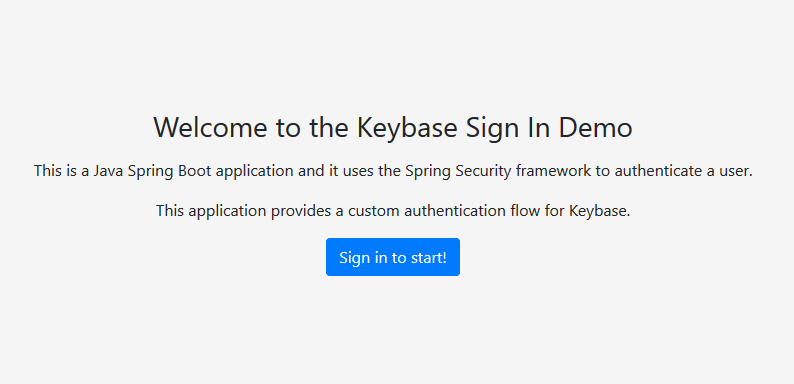
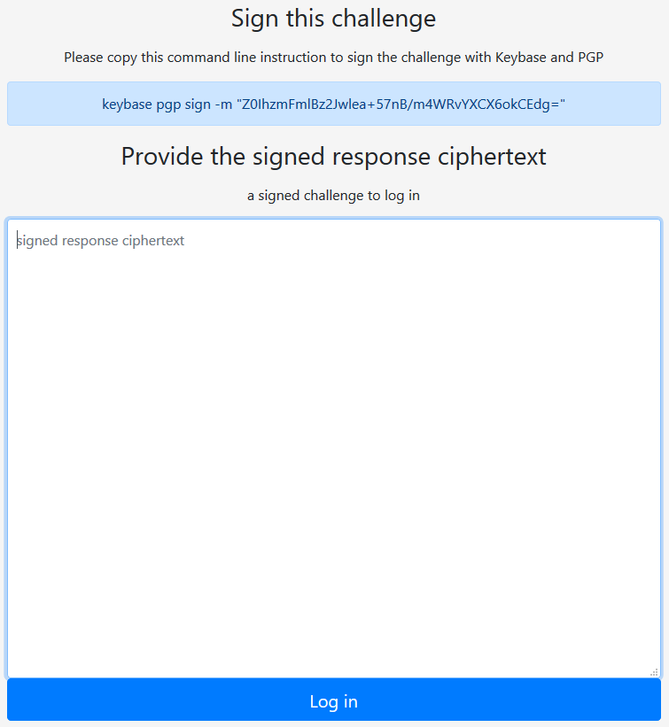
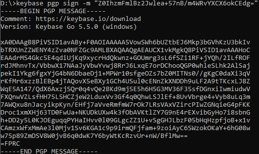
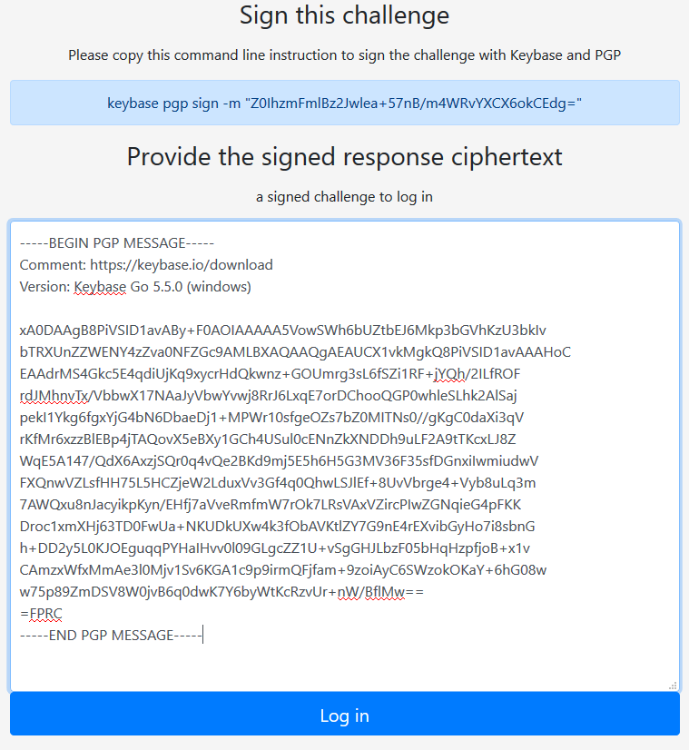
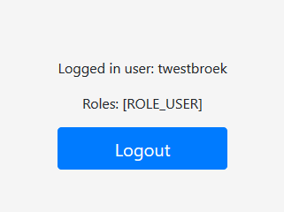

# keybase-login-app


## Implementing Proof of Identity with Keybase in a Java Spring Boot application
The goal of this Java Spring Boot sample application is to show the potential of the ability to prove publicly verifiable identities and use that to implement to authenticate users, using the [Keybase](https://keybase.io) platform.


## Keybase
First a quick summary of Keybase: Keybase is a social networking platform, where secure messaging and file sharing is done through end-to-end encryption. Keybase also allows users to prove their online identities (like [Twitter](https://twitter.com) or [Github](https://github.com)) by putting a signed statement in the social account the user has ownership of. For example, this is my proof that I am saltstuff on Github: https://gist.github.com/saltstuff/016a38d1f74fef5ecc3829d807eb9aff


## Public-Key Cryptography
Now the cool thing is, anybody in the world can send a user on Keybase an encrypted message or file and be ensured that only the recipient can decrypt and read it. Why? Because of public-key Cryptography: I just need to look up the public key of the intended recipient, and then encrypt the message and send it. The receiver is the only person in the world who can decrypt the message, using his/her private key. This private key is private, because it is, unlike passwords or other tokens, never sent across the wire or ether and never shared with anyone. Instead, the private key is securely stored on the device, by the Keybase mobile or desktop apps.


## Encryption and signing
Something that blew my mind years ago when I dived into public-key cryptography, is that there is another very useful purpose: signing and verification. It is mathematically the opposite of encryption: If I want to prove my identity to another user, I need to send a message and encrypt it with my private key. The other user verifies the message by decrypting it with my public key. That way, my identity is proven as I am the only holder of the private key.


## Proof of Identity and authenticating users: the keybase-login-app
This repository contains the keybase-login-app. It shows the strength of public-key-cryptography and the concept of signing and verifying the user. The flow in the app is as follows:
* App generates a text challenge and asks the user to sign (encrypt) it with their private key. 
* User signs the challenge. 
* The result, the ciphertext, is submitted to the app by the user. 
* App checks the public key part of the ciphertext, and checks the key identifier. 
* With this identifier, the Keybase platform is queried to find the username and the public key. 
* App decrypts the message with the public key.
* The message is further validated and if OK, the user’s identity is proven, and the app authenticates the user.


## Spring Security
The app is built in Java, using the Spring Security framework in Spring Boot. Spring Boot is cool, and it runs with a stripped-down Tomcat engine that is part of the application binaries (although this is optional, but I like it). 
Once the app loads, it initializes the programmatic security descriptors. It basically tells which resources in the app are protected and which ones are not. It also sets up the authentication provider chain, and this is where we plug-in our Keybase provider. Finally, there is a servlet filter that intercepts any request and searches for a signed response: if it exists, it will be passed to the authentication chain where it is further handled by the provider and the magic happens that is just being described.


## Bouncy castle
Keybase supports PGP for public-key cryptography, and in the Java world the [Bouncy castle](https://www.bouncycastle.org/java.html) libraries as known for delivering a great implementation of PGP, hence this is part of the app as well.

## Preparing for the demo app

**You need to have the following installed:**
* Java 11 (minimum)
* Keybase account and the Keybase desktop app installed

**Generate a private key**

Open a terminal window and execute:
```bash
keybase pgp gen
```
In the interactive dialog, provide the answers (public username, etc.). The private key will be generated at last.

## Running the demo app

**1. Clone the application**

```bash
git clone https://github.com/saltstuff/keybase-login-app.git
```

**2. Move into the directory**

```bash
cd keybase-login-app
```

**3. Move into the directory and build/run the app**
```bash
mvnw spring-boot:run
```

## Open the app and login with Keybase!

Open a browser and navigate to http://localhost:8080. The following screen appears:




Click on *Sign in to start*. The next screen appears:





Copy and paste the challenge, including the keybase command. Open a terminal and execute the command:

```bash
keybase pgp sign -m "Z0IhzmFmlBz2Jwlea+57nB/m4WRvYXCX6okCEdg="
```

Copy the output from the terminal ...





... and paste it in the browser window of the app.





Click *Log in* and you will be logged in! Your username is displayed on a secure page, and your role within the app [ROLE_USER].




End of the demo.
